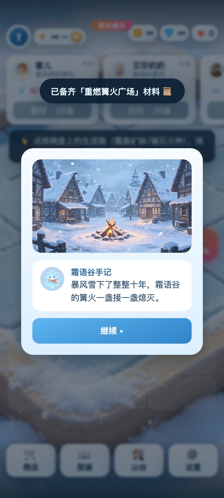

# 冰霜物语 Frost Story

原创竖屏 Merge-2 合并剧情游戏。Android v0.1 已包含完整可玩闭环、3 章共 9 个剧情重建节点、6 条 8 级合成链，以及可拖动吸边的内测爽玩控制台。



## 直接试玩

- Android 8.0+、ARM64：从 [最新版 Release](https://github.com/JackLee992/frost-story/releases/latest) 下载 `FrostStory-arm64.apk`。
- 安装时如系统提示“未知来源”，只为当前浏览器或文件管理器临时允许安装；APK 的 SHA-256 同时附在 Release 中。
- 首次进入会依次引导：点生成器 → 拖拽合并 → 交付订单 → 融化格子 → 商店 → 剧情重建。完整规则可在“设置 → 玩法规则与新手说明”随时回看。

## v0.1 内容

- 6×8 棋盘、Merge-2 拖拽合并、物品换位、出售、冰封格解锁。
- 6 条原创合成链 × 8 级；生成器体力、概率产出和充能机制。
- 3 个动态 NPC 订单槽、金币/钻石/经验/暖意、等级和商店。
- 宝箱倒计时、霜泡、图鉴、自动存档和损坏存档安全迁移。
- 3 章原创故事 × 3 个重建节点；爽玩模式可快速验收全部内容。
- Android 全屏沉浸式显示，使用真机挖孔和系统手势边距约束核心 UI。

竞品机制证据、原创边界与逐项对齐结果见 [竞品拆解](docs/01-竞品拆解与技术路线.md) 和 [玩法对齐验收矩阵](docs/03-竞品玩法对齐验收.md)。

## 可复用核心引擎

`web/js/engine` 是独立维护的 `frost-merge-core` Git submodule，已将原子交易结果、重复点击防护、稳定滚动视图刷新和 Pixi 元数据隔离抽成通用模块。克隆时请使用：

```bash
git clone --recurse-submodules https://github.com/JackLee992/frost-story.git
```

详细问题根因与回归证据见 [故障复盘与回归清单](docs/04-故障复盘与回归清单.md)，其他项目接入见 [核心游戏引擎接入指南](docs/05-核心游戏引擎接入指南.md)。

## 开发与测试

游戏核心是 PixiJS WebGL，Android 使用 Kotlin + GeckoView 独立内核。仓库根目录执行：

```bash
npm ci
python3 -m http.server 8099 -d web
npm test
npx playwright test test/site.spec.js --workers=1
```

Android 构建：

```bash
cd android
./gradlew lintDebug assembleDebug
../tools/create_release_keystore.sh   # 仅首次；私钥保存在 ~/.frost-story，不进入 Git
./gradlew assembleRelease
```

完整 Android 环境和签名说明见 [android/README.md](android/README.md)。

## 动态内容更新

故事、数值、图片、音频和 WebGL 逻辑可通过签名 APK 内置的更新器独立发布；原生 Kotlin 或权限变更仍须发布新 APK。内容包经过 HTTPS 来源限制、大小限制、SHA-256、ZIP 路径和解压配额校验，下载完成后在下一次启动原子切换。发布方法见 [distribution/README.md](distribution/README.md)。

## 版权边界

本项目只对齐合并品类的通用机制与可观察技术架构。角色、剧情、文案、美术、音乐、配置和代码均为本项目重新创作，不包含竞品 APK、解包文件或竞品素材。
